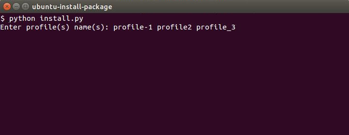

#UBUNTU-INSTALL-PACKAGES

##Install

*	_Download_ or _clone_ this repository
*	Preferably place the folder in the directory `/home`
* 	Let the folder name as `ubuntu-install-package`
*	Access the folder
```
# cd ~/ubuntu-install-package
```

*	Start the installer
```
# sudo python install.py
```



You can informe one or more profiles that will define which packages need to be installed in your system.


##Creating a profile

For installer know what it will install, we need to create a JSON file named profile.

Profiles contains a package name list as ilustrated at below example.

```
[
	"chrome",
	"gimp",
	"inkscape",
	"vlc",
	"rar",
	"ubuntu-restricted-extras",
	"skype",
	"pidgin",
	"adobe-flash-player"
]
```

Save your profile at *profile* folder.